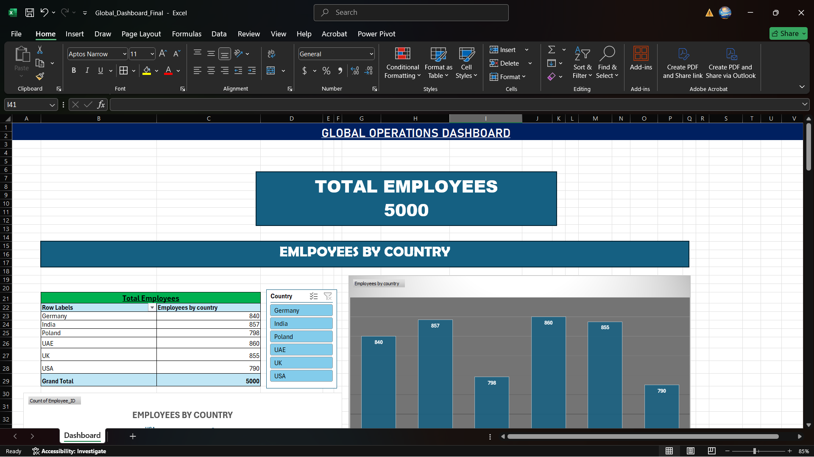
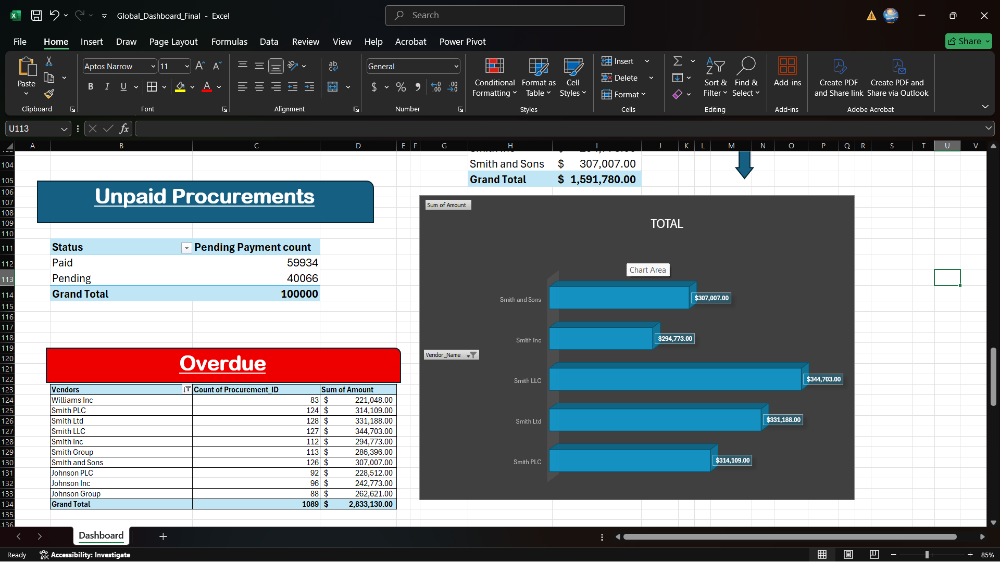

# 🌍 Global Operations Dashboard (Excel + Power Pivot)

This project is a real-world Excel-based dashboard designed to analyze business operations across sales, shipping, and profitability. It utilizes over 1 million rows of structured data with multiple dimensions, cleaned and modeled using Power Query and Power Pivot.

> ✅ Built for decision-makers.  

---

## 📌 Objective

Transform raw operational data into actionable insights through a fully interactive Excel dashboard.

---

## 🧰 Tools & Features

- **Excel Power Query** – for large dataset cleaning and transformations
- **Power Pivot** – for data modeling and DAX calculations
- **Slicers & Pivot Charts** – for dynamic filtering
- **KPIs & Visuals**:
  - Total Sales & Profit
  - Delayed Shipment Count
  - Shipping Cost by Region
  - Product Category Trends
  - Segment-wise Performance

---

## 🗂 Data Highlights

- **Source**: Raw multi-sheet business dataset (1M+ rows)
- **Key Fields**:
  - `Order Date`, `Ship Date`, `Region`, `Country`
  - `Segment`, `Category`, `Sub-Category`
  - `Sales`, `Profit`, `Shipping Cost`, `Quantity`
- **Calculated Metrics**:
  - Average Delivery Delay
  - Profit Margin %
  - Sales per Segment

---

## 📊 Dashboard Screenshots

<p float="left">
  
  
</p>

---

## 🔍 What I Learned

- How to optimize Excel models for large datasets using Power Query
- DAX calculations for business KPIs
- Creating user-friendly slicers and visual elements
- Storytelling through dashboards

---

## 📎 File Structure

```bash
📁 global-dashboard-excel-project/
├── Global_Dashboard_Final.xlsx
├── dashboard-screenshots/
├── README.md
